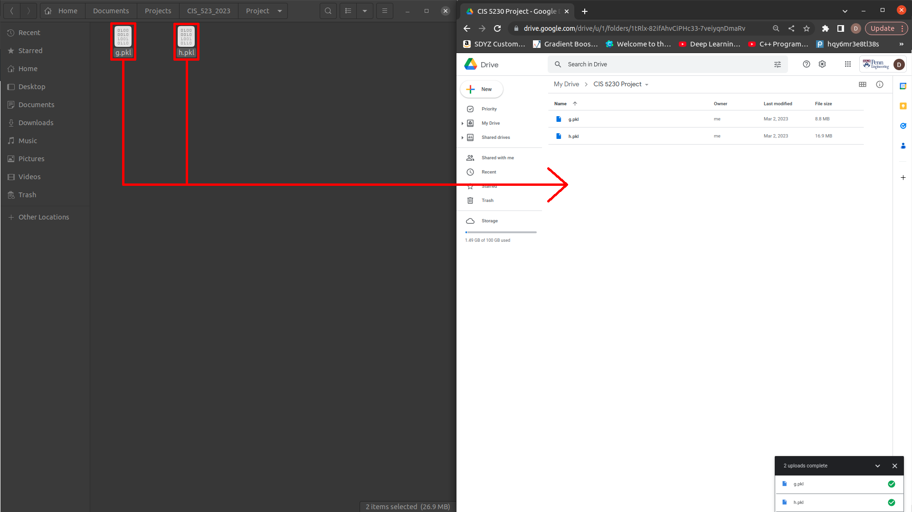
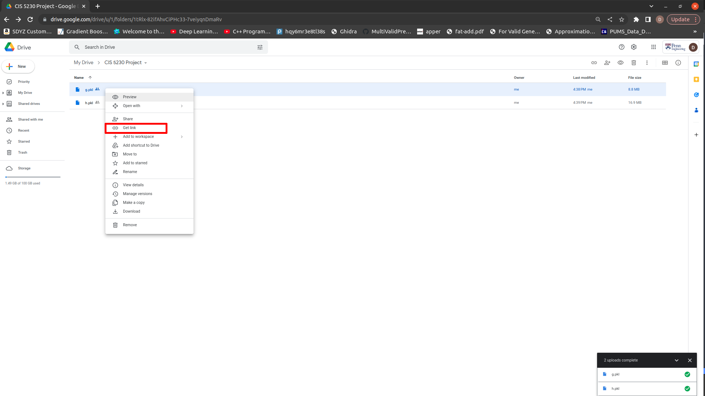
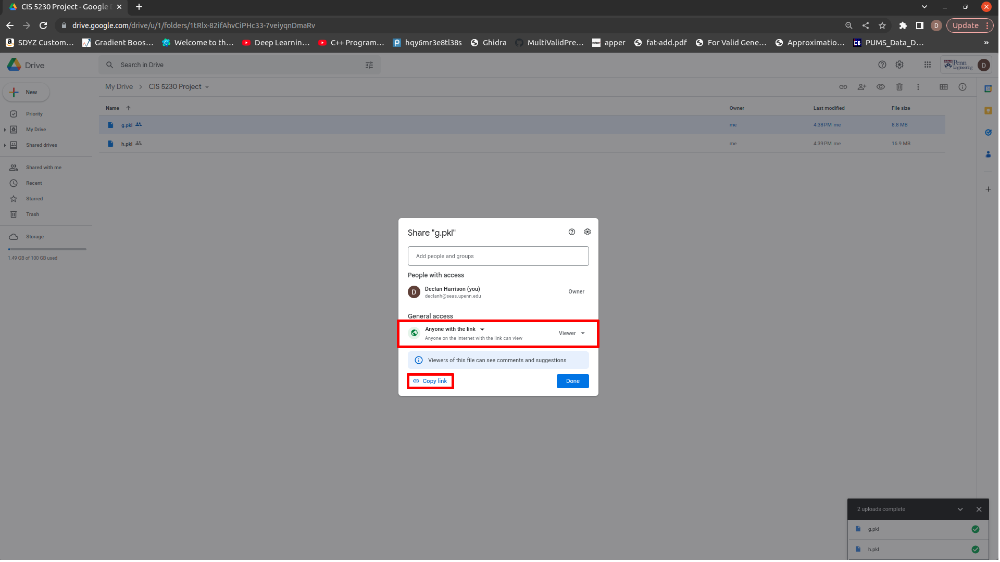
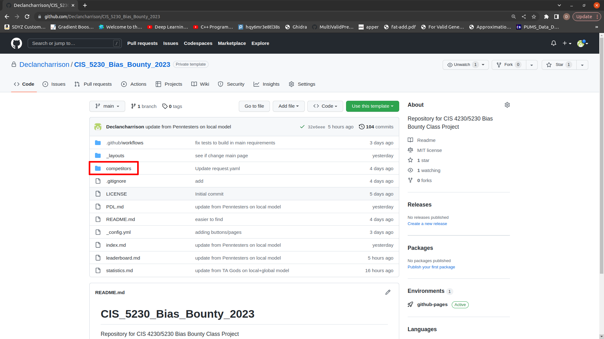
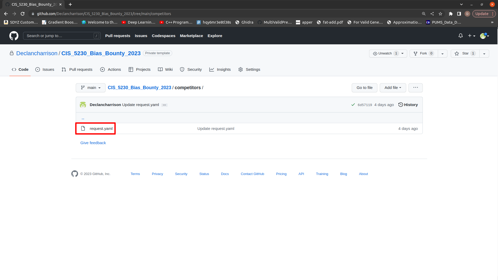
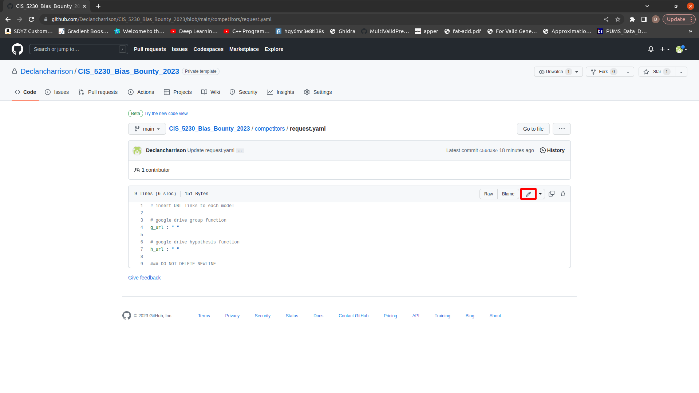
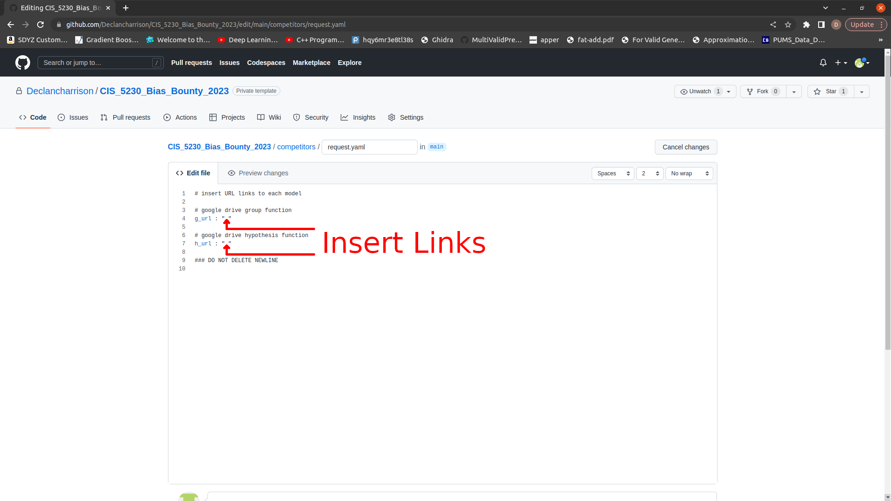
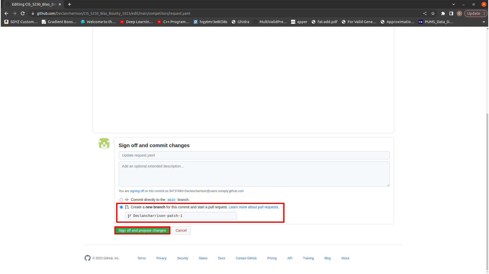
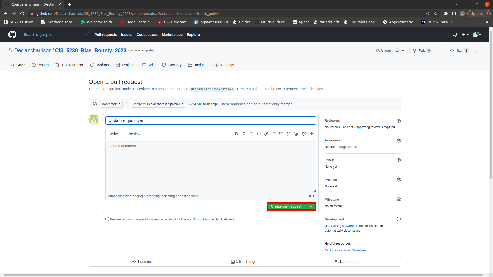

# A True Bias Bounty

## **Introduction**

In this repository (and [webpage](https://declancharrison.github.io/CIS_5230_Bias_Bounty_2023/)), you will find all the tools necessary to participate in the first ever ML Bias Bounty. This repository acts as a sort of "middle man" infrastructure to connect you (competitors) to a host server containing a global PDL model. You are able to submit group-hypothesis (g,h) pairs via pull requests, and the pair is integrated into the global model per the PointerDecisionList (PDL) protocol. The remainder of the readme is dedicated to the full workflow from training your pair of functions to submitting the update request and viewing the results of the PDL Protocol. You can download the .ipynb notebook named *starter_notebook.ipynb* to follow along the procedures below.

## **Downloading/Importing the data**

Navigate to the project webpage [here](https://declancharrison.github.io/CIS_5230_Bias_Bounty_2023/)
and click the button "Download Training Data". Extract the downloaded .zip file and place the two files titled *training_data.csv* and *training_labels.csv* in the folder you will be working in. To load the data into your python environment, you can run the following:
```python
import pandas as pd
import numpy as np
x_train = pd.read_csv('training_data.csv') 
y_train = np.genfromtxt('training_labels.csv', delimiter = ',', dtype = float)
```

## **Training a (g,h) pair**

A (g,h) pair is comprised of two functions: a group indicator function and a predictive model function. 

For the group indicator function g, it is expected that g takes a data matrix X and returns an array of 0s and 1s with length equal to the len of the array X, i.e. if there are 100 instances in X, then g(X) should return a Numpy array of shape (100, ). Below is an example for Folktables for an indicator function returning individuals identified as white:
```python
def g_white(X):
    return X['RAC1P'] == 1
```

*Note*: if you use the word *for* in your group function and it is not a super complicated group, you are likely doing something wrong. NumPy is wonderful at doing work in parallel and since you are updating to a global model, we want things to be as fast as possible. Here is another example of a more complicated group function which accepts individuals indentified as black or white and above the age of 50:

```python
def g_white_or_black_and_old(X):
    return ( (X['RAC1P'] == 1 | X['RAC1P'] == 2 ) & (X['AGEP'] >= 50) )
```

For the hypothesis function h, the specifications are similar to the group function. It is expected that h takes a data matrix X and returns an array of float values with length equal to the len of the array X, i.e. if there are 100 instances in X, then h(X) should return a Numpy array of shape (100, ). Generally, h will be an ML model from scikit-learn which does not accept inputs without using the .predict(X) method. Thus, when you define your hypothesis function, you will define h to be clf.predict, which will allow you to use syntax h(X). Below is an example of a training a classifier using scikit-learn and then defining the hypothesis function:

```python
import sklearn as sk

# initialize ML hypothesis class
clf = sk.tree.DecisionTreeRegressor(max_depth = 5, random_state = 42)

# fit model to data
clf.fit(X, y)

# define hypothesis function as bound clf.predict
h = clf.predict
```

*Note*: if you simply define h to be clf, your hypothesis function will not save properly nor will it follow correct syntax! If you attempt an update with a hypothesis function of the wrong sort it will immediately be denied!

It is worth mentioning there is no reason that you wouldn't be able to train a group function to be an arbitrarily complex ML model. You can use a binary classification model as a group function as show below:

```python
import sklearn as sk

# initialize ML hypothesis class
clf = sk.tree.DecisionTreeClassifier(max_depth = 5, random_state = 42)

# fit model to data
clf.fit(X, y)

# define group function as bound clf.predict
g = clf.predict
```

## **Training a hypothesis function over a group**

After defining a region (group) in which you believe the model performs suboptimally, say individuals identified as white, you may wish to create a hypothesis function trained over solely the data in this group. You can do so by doing the following:

```python
import sklearn as sk

# define group function
def g(X):
    return X['RAC1P'] == 1

# initialize ML hypothesis class
clf = sk.tree.DecisionTreeRegressor(max_depth = 5, random_state = 42)

# find group indices on data
indices = g(X)

# fit model specifically to group
clf.fit(X[indices], y[indices])

# define hypothesis function as bound clf.predict
h = clf.predict
```

While training a hypothesis function speficically on group data may be useful, you should remember you are restricting the amount of data you are allowing your model to be trained on. Thus, your model will inherently be more prone to overfitting. Another method you might consider is instead of restricting the data you are training on, maybe you upsample the items in the group to be a greater weight in the dataset, effectively making them more important in your classifier. This is a largely understudied area in terms of this project, so please record and document your methods in this direction!

## **Saving functions for submission**

A common way to save scikit-learn models is to *pickle* them, or to byte serialize them. While *pickle* is a wonderful package, we need something a little more powerful, and will be using a package called *dill*, which extends on the base *pickle*. 

The generic method to saving an item is:

```python
import dill as pkl

with open('filename.pkl', 'wb') as file:
    pkl.dump(item, file)
```

The generic method to loading an item is:

```python
import dill as pkl

with open('filename.pkl', 'rb') as file:
    item = pkl.load(file)
```

From our running example, this is how you would train a (g,h) pair and save them to the files 'g.pkl' and 'h.pkl':


```python
import dill as pkl
import sklearn as sk

# define group function
def g(X):
    return X['RAC1P'] == 1

# initialize ML hypothesis class
clf = sk.tree.DecisionTreeRegressor(max_depth = 5, random_state = 42)

# find group indices on data
indices = g(X)

# fit model specifically to group
clf.fit(X[indices], y[indices])

# define hypothesis function as bound clf.predict
h = clf.predict

# save group function to g.pkl
with open('g.pkl', 'wb') as file:
    pkl.dump(g, file)

# save hypothesis function to h.pkl
with open('h.pkl', 'wb') as file:
    pkl.dump(h, file)

```

## **Uploading your pair**

We will be using Google Drive for simplicity to upload your group and hypothesis functions to a public place for the server to download. Navigate to Google Drive and drag and drop the two files corresponding to your group and hypothesis functions into Google Drive. From the example above, the group function file is called 'g.pkl' and the hypothesis function file is called 'h.pkl'



## **Requesting an update**

Once you have uploaded your functions to Google Drive, you are ready to submit an update request. You first need to get the URLs to your group and hypothesis function files. To get the URLs, you will right click on each respective file in Google Drive and click "get link". From there, you must ensure the file is available to all with link, and then will click "copy link". 




Next,navigate to the Github Repository and select the folder title 'competitors'. From there, you will click on 'request.yaml' and see a .yaml file with two variables: *g_url* and *h_url*. 




Next, click on the small pencil in the upper right corner to edit the 'request.yaml' file:




Within the quotes next to *g_url*, you will place the link to your 'g.pkl' file from Google Drive. Similarly, within the quotes next to *h_url* you will place the link to your 'h.pkl' file from Google Drive. 



Scroll to the bottom of the page and create a new branch with your changed file. Note, you will not have access to commit to the main branch since it is protected:



This will open a second prompt where you will click the button for "Create pull request":



Viola! Your pair has been submitted and the PDL Protocol will run on the server.

## **Viewing the results of the PDL Protocol**

After a potential update terminates in the PDL Protocol, there will be a comment made on the pull request. The pull request will be deleted within about 30 seconds of being created, though the comments will persist and be sent to the GitHub user's email address (if  default settings are applied).

